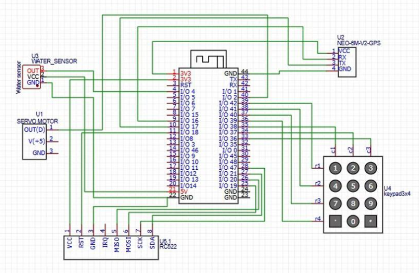
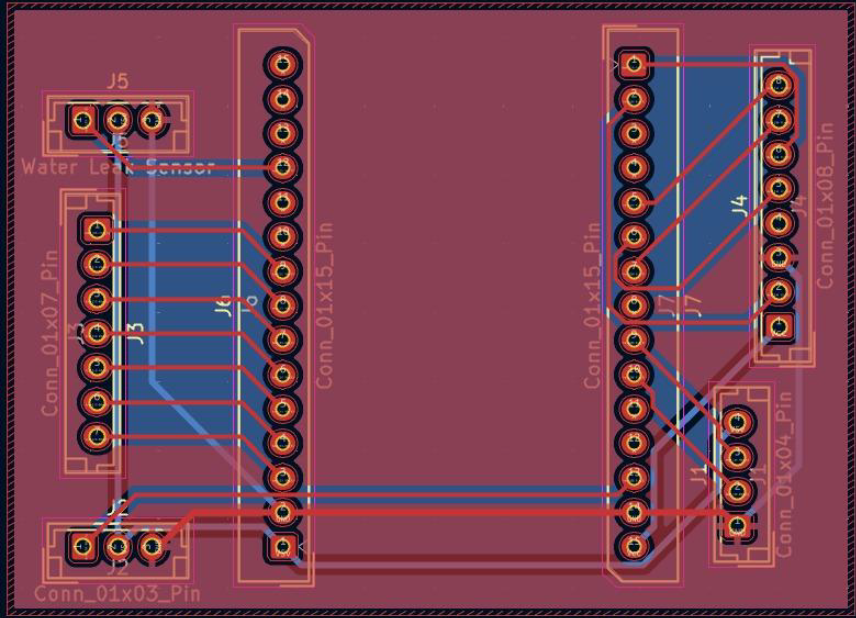
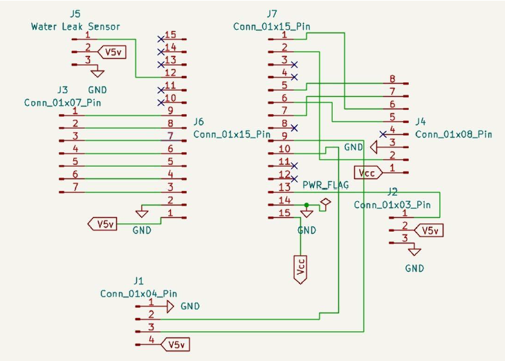
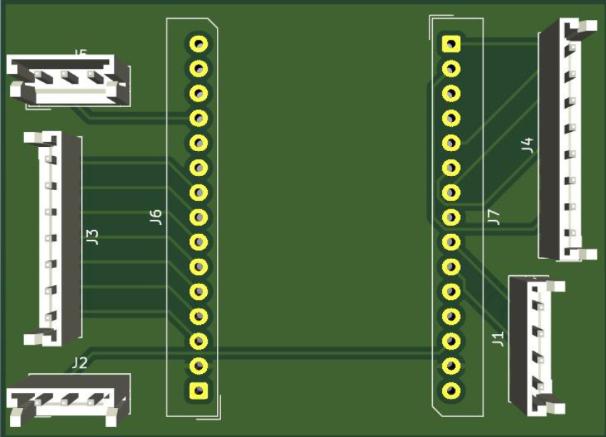
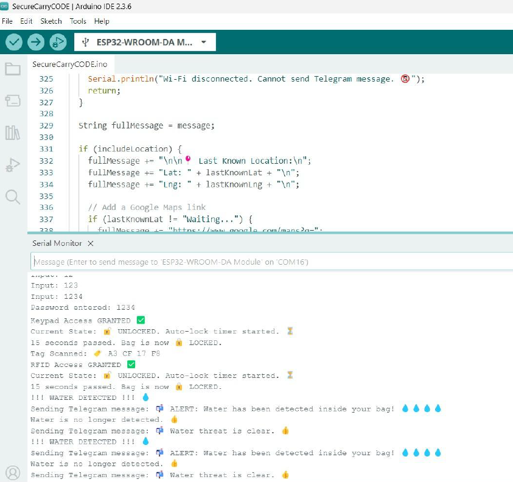

# SecureCarry – Intelligent Smart Bag

An ESP32-based IoT smart bag security system that provides multi-layer authentication, real-time theft alerts, GPS tracking, and water leakage detection. The system combines embedded systems, IoT communication, and hardware security to protect personal belongings during travel or everyday use.

---

# 📌 Project Overview

SecureCarry is designed to improve the safety of personal belongings such as laptops, documents, and electronics. The system integrates RFID authentication, keypad-based password protection, GPS location tracking, and water leakage detection with instant Telegram notifications.

The project demonstrates real-time embedded system implementation using ESP32 with both hardware and software integration.

---

# 🚀 Features

- 🏷️ RFID-based authentication
- ⌨️ Keypad password security
- 🦾 Servo-controlled locking mechanism
- 📍 GPS tracking using NEO-6M
- 💧 Water leakage detection
- 📬 Real-time Telegram alerts
- 🔒 Auto-lock after inactivity
- 🔋 Portable battery-powered system
- 🌐 IoT-based monitoring

---

# 🛠️ Hardware Components

| Component | Description |
|---|---|
| ESP32 WROOM | Main microcontroller |
| RC522 RFID Module | RFID authentication |
| 4x3 Keypad | PIN-based access |
| SG90 Servo Motor | Locking mechanism |
| NEO-6M GPS Module | Location tracking |
| Water Sensor | Leak detection |
| TP4056 Charging Module | Battery charging |
| Li-ion Battery | Portable power supply |

---

# 💻 Software & Technologies

- Arduino IDE
- Embedded C/C++
- ESP32 Board Libraries
- UniversalTelegramBot Library
- TinyGPS++
- MFRC522 RFID Library
- ESP32Servo Library
- SPI Communication
- UART Communication

---

# ⚙️ Working Principle

1. The system remains in **LOCKED** mode by default.
2. User scans an authorized RFID tag.
3. If RFID authentication fails multiple times, the system switches to keypad mode.
4. User enters password using keypad.
5. Upon successful authentication, the servo motor unlocks the bag.
6. Water sensor continuously monitors for liquid intrusion.
7. ESP32 sends Telegram alerts during:
   - Failed access attempts
   - Water leakage detection
8. GPS coordinates are included in alert messages.
9. System automatically locks after 15 seconds of inactivity.

---

# 🔄 State Machine

The firmware operates using three states:

```text
LOCKED
   ↓
KEYPAD_MODE
   ↓
UNLOCKED
```

### States

- 🔒 LOCKED → Default secure mode
- ⌨️ KEYPAD_MODE → Activated after failed RFID attempts
- 🔓 UNLOCKED → Access granted

---

# 🔌 Pin Configuration

| Component | GPIO Pins |
|---|---|
| Servo Motor | GPIO 15 |
| RFID SS | GPIO 21 |
| RFID RST | GPIO 22 |
| Water Sensor | GPIO 34 |
| GPS RX2 | GPIO 16 |
| GPS TX2 | GPIO 17 |
| Keypad Rows | 13, 12, 14, 27 |
| Keypad Columns | 26, 25, 33 |

---

# 📂 Project Structure

```text
SecureCarry/
│
├── Arduino_Code/
│   └── SecureCarryCode.ino
│
├── Circuit_Diagram/
│   └── circuit_diagram.png
│
├── PCB_Design/
│   ├── pcb_layout.png
│   ├── pcb_3d_view.png
│   └── pcb_schematic.png
│
├── Hardware_Images/
│   └── hardware_implementation.jpg
│
├── Output_Images/
│   └── serial_monitor.png
│  
│
│
└── README.md
```

---

# 📸 Project Images

## 🔌 Circuit Diagram



---

## 🛠️ PCB Layout



---

## 📐 PCB Schematic



---

## 🖥️ PCB 3D View



---

## 🔧 Hardware Implementation


---

## 📟 Serial Monitor Output



---

# 📬 Telegram Alert System

The system sends real-time Telegram notifications for:

- 🚨 Failed RFID attempts
- ❌ Incorrect keypad password
- 💧 Water leakage detection

Alerts can also include:
- GPS latitude & longitude
- Google Maps tracking link

---

# 📍 GPS Tracking

The NEO-6M GPS module continuously updates location coordinates. During security alerts, the system shares:

- Latitude
- Longitude
- Google Maps tracking link

---

# 🔋 Power System

The project uses:
- Li-ion battery
- TP4056 charging module

This enables portable and rechargeable operation.

---

# 🧠 Embedded System Concepts Used

- State Machine Design
- GPIO Interfacing
- UART Communication
- SPI Communication
- PWM Servo Control
- Sensor Integration
- IoT Communication
- Real-Time Monitoring

---

# 📈 Results

✅ Successful RFID authentication  
✅ Reliable keypad password validation  
✅ Real-time Telegram alert delivery  
✅ Accurate GPS coordinate sharing  
✅ Water leakage detection working properly  
✅ Stable servo locking/unlocking operation  
✅ Successful auto-lock implementation  

---

# 💰 Cost Analysis

| Component | Cost (₹) |
|---|---|
| ESP32 WROOM | 350 |
| RFID RC522 | 450 |
| Keypad | 80 |
| Servo Motor | 150 |
| Water Sensor | 100 |
| GPS Module | 200 |
| TP4056 | 50 |
| Wires & Connectors | 150 |

### Total Estimated Cost: ₹1580

---

# 🔮 Future Improvements

- 🔐 Fingerprint authentication
- 📱 Mobile app integration
- ☁️ Cloud database logging
- 🔋 Battery level monitoring
- 📡 LoRa / GSM communication
- 🚨 Buzzer alarm system
- 📷 Camera-based monitoring

---

# 🎯 Applications

- Smart travel luggage
- Secure laptop bags
- Anti-theft student bags
- Industrial equipment safety
- Smart document protection

---

# ⭐ Skills Demonstrated

- Embedded Systems
- IoT Development
- ESP32 Programming
- PCB Design
- Sensor Integration
- Arduino Development
- GPS Integration
- RFID Systems
- Real-Time Monitoring
- Hardware Prototyping

---

# 📜 License

This project is developed for educational and research purposes.

---

# 🌟 Acknowledgement

This project was developed as part of the Embedded System Design course under the guidance of faculty members at VIT Chennai.
